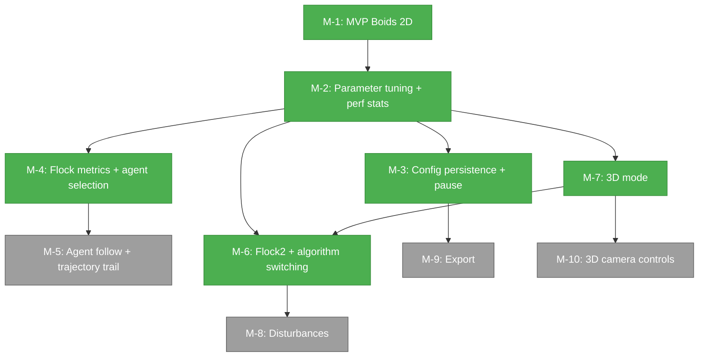

# Project Status Report

**Generated:** 2026-03-09T20:02:40.354920+00:00

---

## Health snapshot

| | Count |
|---|---|
| Milestones completed | 6 |
| Milestones in progress | 0 |
| Milestones planned | 4 |
| Issues done | 38 |
| Issues in progress | 0 |
| Issues open (backlog) | 29 |
| Bugs open | 2 |
| Bugs resolved | 2 |

---

## Milestone roadmap

---

## Per-milestone summary

| Milestone | Status | Issues Done / Total | Bugs Raised | Bugs Resolved |
|-----------|--------|---------------------|-------------|---------------|
| M-1: MVP Boids 2D | Completed | 6 / 6 | 0 | 0 |
| M-2: Parameter tuning + perf stats | Completed | 7 / 7 | 1 | 1 |
| M-3: Config persistence + pause | Completed | 6 / 6 | 0 | 0 |
| M-4: Flock metrics + agent selection | Completed | 6 / 6 | 1 | 1 |
| M-5: Agent follow + trajectory trail | Planning | 0 / 8 | 1 | 0 |
| M-6: Flock2 + algorithm switching | Completed | 7 / 7 | 0 | 0 |
| M-7: 3D mode | Completed | 6 / 6 | 0 | 0 |
| M-8: Disturbances | Planning | 0 / 8 | 0 | 0 |
| M-9: Export | Planning | 0 / 5 | 0 | 0 |
| M-10: 3D camera controls | Planning | 0 / 7 | 0 | 0 |

---

## Currently in-flight

No issues currently in progress.

---

## Open bugs by priority

| ID | Title | Priority | Milestone |
|----|-------|----------|-----------|
| ISS-7 | Birds disappear at viewport edge (visualization) | Medium | M-5 |
| ISS-76 | Telemetry shows 2D position/velocity when switched to 3D with agent selected | Medium | — |

---

## Unassigned backlog

| ID | Title | Type | Priority |
|----|-------|------|----------|
| ISS-14 | Document surviving boids mutation test mutants | chore | Low |
| ISS-17 | Improve parameter controls with direct input, help text, and reset | feature | Low |
| ISS-34 | Support named config files for multiple saved configurations | feature | — |
| ISS-72 | Add explanatory text for flock metrics | task | — |
| ISS-73 | Populate agent ID in selection field or telemetry when clicking | task | — |
| ISS-74 | Highlight neighbours in telemetry with distinct colour | task | — |
| ISS-75 | Click-to-select does not work in 3D mode | task | — |
| ISS-76 | Telemetry shows 2D position/velocity when switched to 3D with agent selected | bug | Medium |
